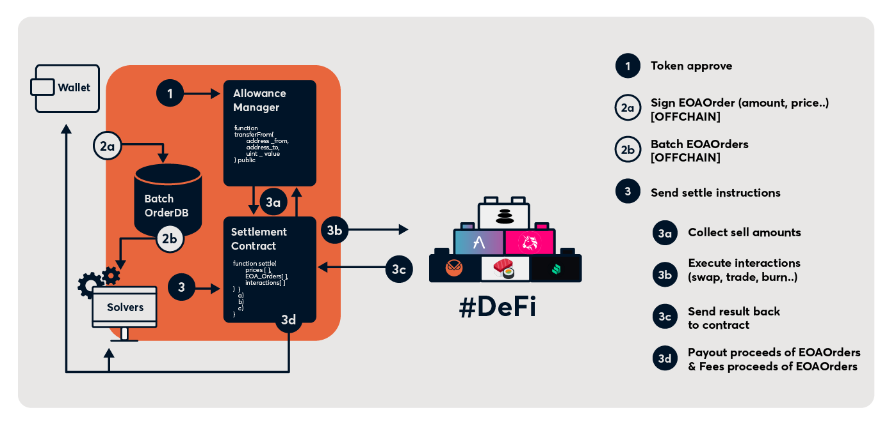

# Smart Contract Architecture Overview

Below is a brief description of the smart contracts located in the `src/contracts/` directory:

- `GPv2Settlement.sol`: The entrypoint for Gnosis Protocol V2; authenticated solvers call the `settle` function on this contract to perform batched settlements.
- `GPv2AllowListAuthentication.sol`: The allow list authentication contract is a simple `GPv2Authentication` implementation that manages a list of solvers that are authorized to perform settlements.
- `GPv2VaultRelayer.sol`: The vault relayer is the contract users authorize on the Balancer v2 `Vault` enabling control of user balances; it is intentionally kept as a separate contracts so that SC interactions do not have access to this authorization.
- `interfaces/`
  - `GPv2Authentication.sol`: Authentication interface.
  - `GPv2EIP1271.sol`: EIP-1271 related interfaces used for smart contract signed orders.
- `libraries/`
  - `GPv2EIP1967.sol`: EIP-1967 related helpers for interacting with the proxy contract's storage.
  - `GPv2Interaction.sol`: Library for GPv2 smart contract interactions.
  - `GPv2Order.sol`: Library containing GPv2 order data and helper methods.
  - `GPv2SafeERC20.sol`: Optimized library for performing safe ERC20 interactions with non-standard implementation.
  - `GPv2Trade.sol`: Library defining GPv2 trade data; trades include the data to reconstruct the original order signed by a user as well as execution information computed by off-chain solvers.
  - `GPv2TradeExecution.sol`: Library wrapping in/out transfers for the computed trade executions.
- `mixins/`
  - `GPv2Signing.sol`: Signing mixin containing all functionality related to recovering an order's owner from a signature.
- `reader/*`: Additional reader extention contracts for use with `StorageAccessible`.
- `test/*`: Various contracts used for testing and benchmarking purposes, and not actually part of the final deployment.

The following diagram provides an overview of how the contracts work with off-chain infrastructure and on-chain liquidity when performing a settlement:

